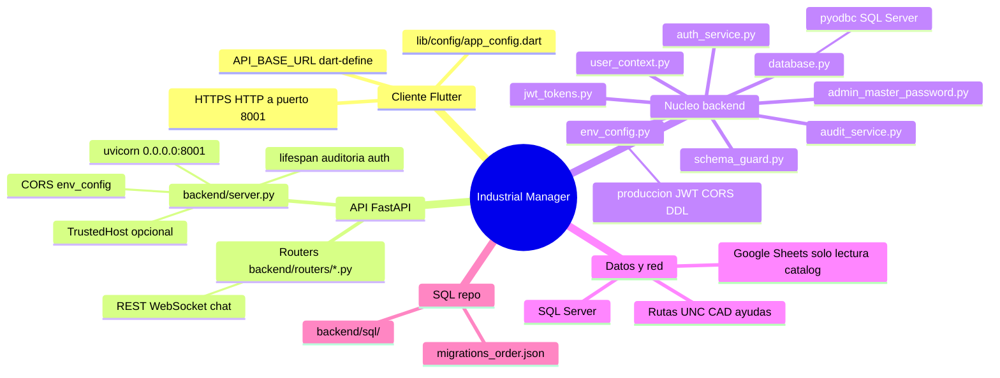
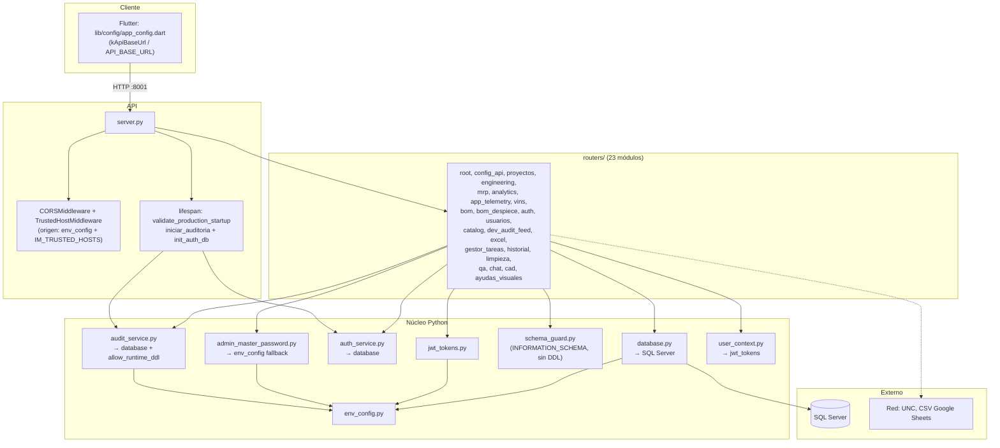

# Mapa de conexiones (stack Industrial Manager)

**Respaldo Git previo a migración de servidor:** commit `69a704d` en rama `v15.5_Clean_Rebuild` (mensaje: respaldo pre-migración). Para volver: `git checkout 69a704d` o `git revert` según política del equipo.

Los diagramas siguientes resumen **dependencias entre archivos y sistemas**, no cada endpoint.

---

## 1. Mapa mental (visión rápida)

---

## 2. Capas: de `server.py` hacia afuera

---

## 3. Quién usa qué (transversal)

| Archivo / concepto | Usado por |
|--------------------|-----------|
| `database.get_db_connection` | Casi todos los routers; `auth_service`, `audit_service`, `run_migration` |
| `env_config` | `server`, `database`, `jwt_tokens`, `admin_master_password`, `audit_service`, y routers: catalog, config_api, chat, app_telemetry, ayudas_visuales, excel (`allow_local_file_launch`) |
| `schema_guard` | `catalog` (columnas), `config_api`, `chat`, `app_telemetry` (tablas) |
| `jwt_tokens` | `auth`, `usuarios`, `dev_audit_feed`, `app_telemetry`; vía `user_context`: `bom`, `bom_despiece`, `cad`, `engineering`, `gestor_tareas`, `ayudas_visuales`, `limpieza`, `usuarios` |
| `auth_service` | `server` (init), `auth`, `usuarios` |
| `audit_service` | `server` (inicio), `catalog`, `config_api`, `excel`, `limpieza`, `qa`, `cad`, `gestor_tareas`, `ayudas_visuales` |
| `admin_master_password` | `gestor_tareas`, `ayudas_visuales` |
| `user_context.resolve_actor_user` | `bom`, `bom_despiece`, `cad`, `engineering`, `gestor_tareas`, `ayudas_visuales`, `usuarios`, `limpieza` |
| `bom_despiece_service` | `routers/bom_despiece` |

---

## 4. Scripts y documentación operativa

| Ruta | Relación |
|------|----------|
| `backend/run_migration.py` | Usa `database.CONNECTION_STRING` → SQL Server |
| `backend/sql/migrations_order.json` | Orden sugerido de scripts |
| `docs/MIGRACION_QUÉ_MOVER.md` | Checklist cutover |
| `docs/RUNBOOK_SERVIDOR_DEDICADO.md` | Variables, health, go-live |
| `docs/GOBERNANZA_SQL.md` | Política DDL / `IM_ALLOW_RUNTIME_DDL` |

---

*Generado para facilitar la migración a servidor dedicado; actualizar el diagrama si se añaden routers o módulos núcleo.*
